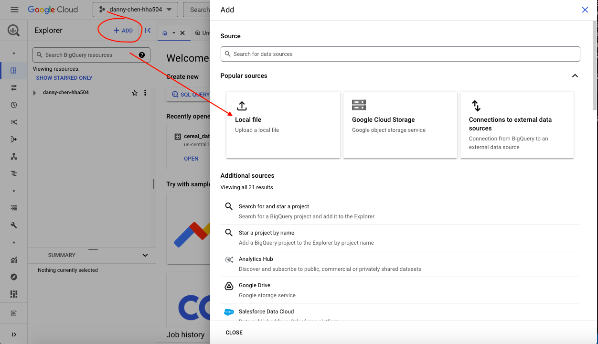
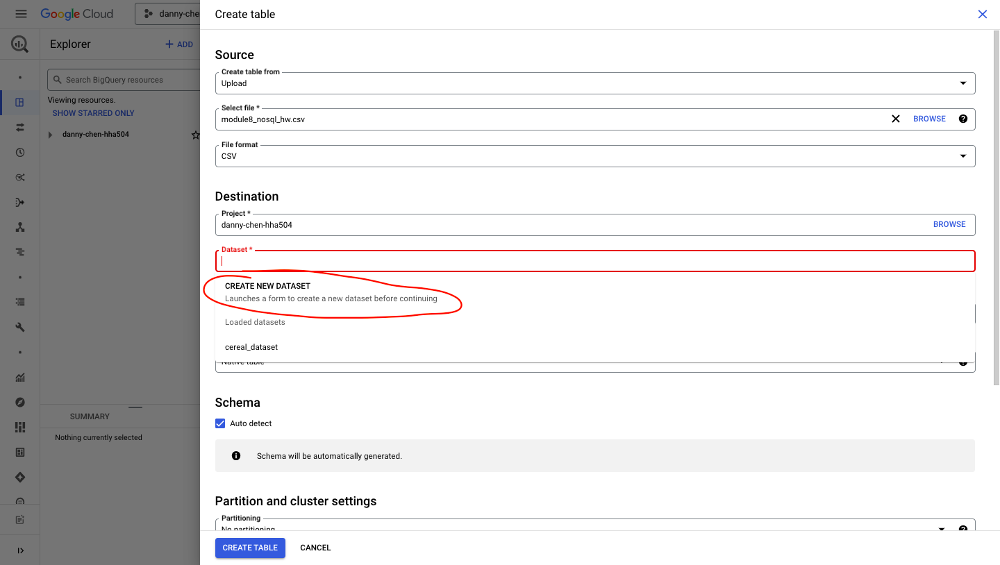
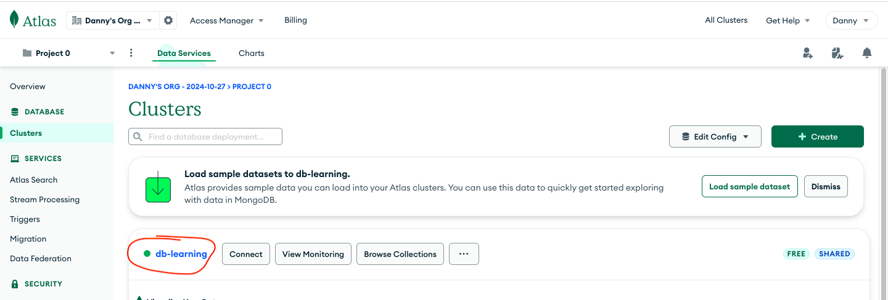
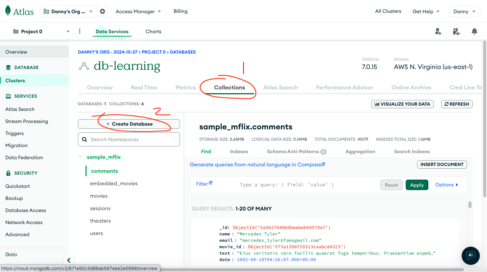
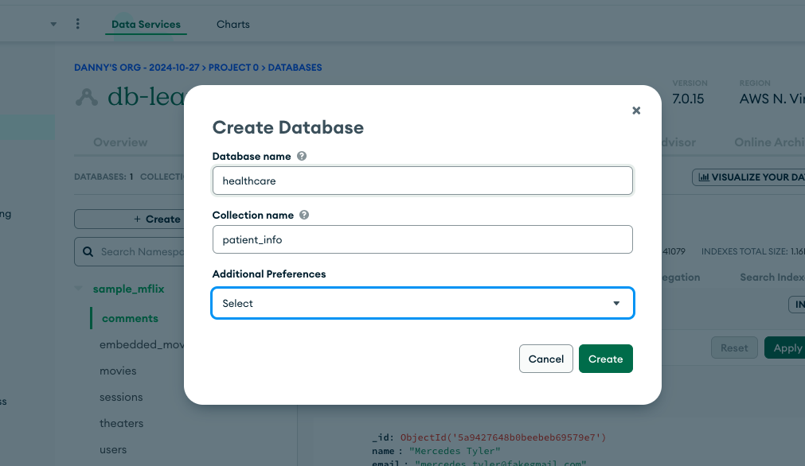
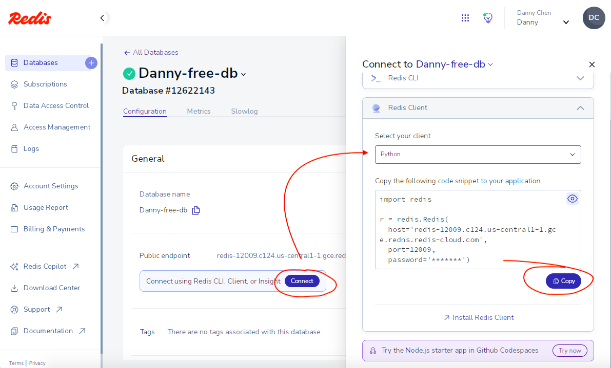
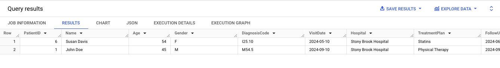
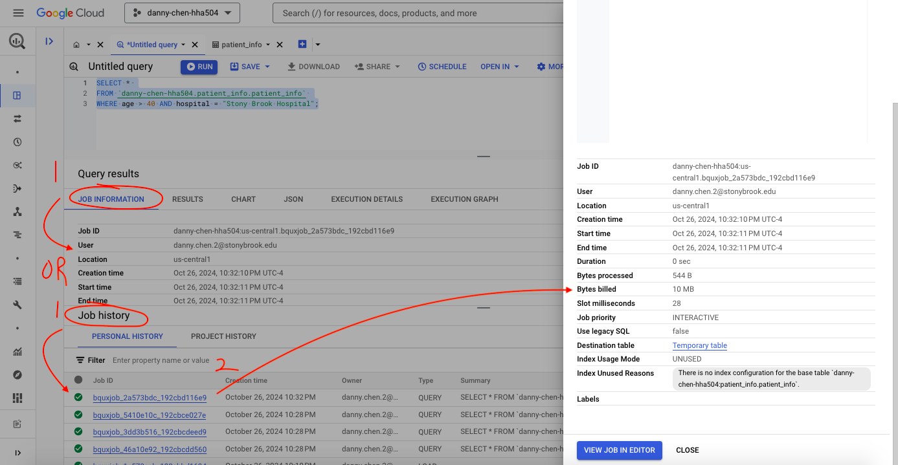
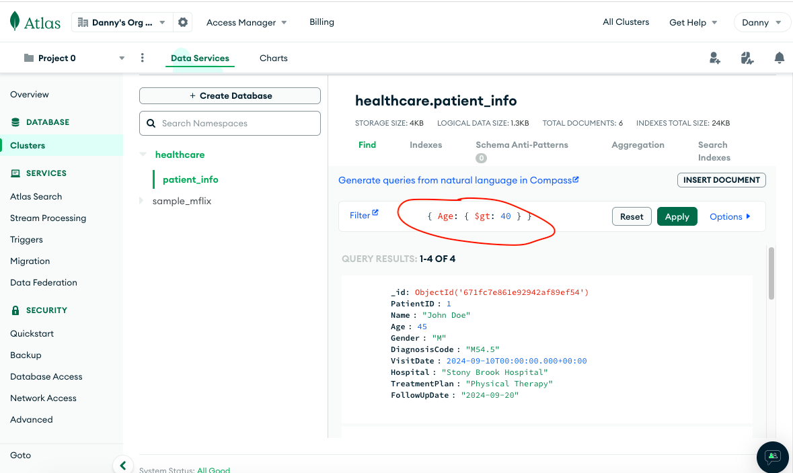

# Working with Managed No-SQL Databases

## 1. Database Creation and Configuration
### Google BigQuery (GCP):
1. On BigQuery's default page, click "+Add" and then "Local file"

2. The following were done:
    * Select file: (browse and upload your csv file)
    * File format: CSV
    * Table: (a name related to what the CSV file about)
    * Auto detect: checked
3. Click the "Dataset" box and click "Create New Dataset." These configurations were applied:
    * Dataset ID: (enter some name)
    * Location type: Region
    * Region: (closest region to you)
4. Create the dataset, then create the table


### MongoDB Atlas (Cloud):
1. Click your cluster

2. Click the "Collection," then "+ Create Database"

    * Name the database and collection (aka table), then create it


### Redis Cloud
1. In the specific database, click "Connect"
2. Change to your desired client
3. Copy the code and adjust it as needed in your editor

    * NOTE: Scroll down in the database page to find your password
4. [redis_connect.py](https://github.com/dnce17/HHA504_assignment_nosql_dbs/blob/main/redis_connect.py)
    * contains code to connect to the database and insert data into it

## 2. Explore BigQuery (GCP)
1. The following query was ran:
```sql
SELECT * 
FROM `danny-chen-hha504.patient_info.patient_info` 
WHERE age > 40 AND hospital = "Stony Brook Hospital";
```
2. Results:

3. The usage and cost of a query can be found by either:
    * clicking "Job Information" to view details about the current query
    * opening the job history to view info on all previously run queries.


## 3. Modify and Explore the Data in MongoDB Atlas and Redis Cloud
### MongoDB Atlas (Cloud):
1. [mongodb_connect.py](https://github.com/dnce17/HHA504_assignment_nosql_dbs/blob/main/mongodb_connect.py) 
    * contains code to connect to the database and insert data into a collection (table)
        * NOTE: CSV file was converted to JSON-like format before being pushed into the collection
2. Queries follow a different convention than SQL
    * e.g. { Age: { $gt: 40 } }
        * This condition was used to get documents with age > 40
        * [Aggregation Operators](https://www.mongodb.com/docs/manual/reference/operator/aggregation/) - more operators are written here


## 4. Describe Your Experience
### Question: 
For each of the three services (BigQuery, MongoDB Atlas, Redis Cloud), document your experience creating and working with the healthcare dataset:
* Describe the setup process and any configuration steps.
    * Already described in the steps above in the other headers
* Share your reflections on the interface and usability of each platform.
    * NOTE: For reflection, talk about what was similar, dissimilar, pain points, did you need to do anything to the data to make it play nicely, etc. That sort of stuff.

 BigQuery, MongoDB Atlas, and Redis Cloud all differ in their ability to run queries and upload and view data. BigQuery allows both of those functions directly on the browser. MongoDB Atlas allows only running queries on the browser it seems, but uploading dataset seem to require MongoDB Compass or an editor. Redis Cloud appears to not allow either functions on the browser and must be done with tools like Redis Insight or an editor. 

The interface of all three services' website was fairly user-friendly. The labels were clear and didn't require clicking through a lot of links to get what was desired like connection details, running queries, or uploading files. In terms of usability, Redis' website feels the least usable as even basic functions like viewing data have to be done through outside tools. 

MongoDB Atlas seems to require correcting the data type for certain data like dates. When pushing the patient info dataset to MongoDB, the date columns were treated as strings and required conversion. Having certain fields like PatientID act as unique identifiers needed to be set manually too, which is also the case for Redis Cloud too. For both services, connection details are provided, which is required to push data to their respective databases.